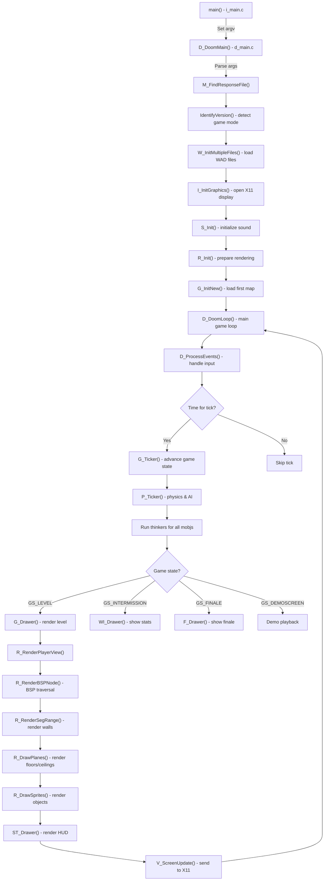

# Runtime Flow

## Main Commands and Entry Points

The main executable is built from `linuxdoom-1.10/Makefile`:

```bash
make -C linuxdoom-1.10           # Builds linuxxdoom executable
./linuxdoom-1.10/linux/linuxxdoom  # Run the game
```

Command-line options (parsed in `d_main.c`):
- `-iwad <file>` — Path to DOOM or DOOM2 game data (IWAD)
- `-file <files>` — Additional WAD files (PWADs for mods)
- `-skill <0-4>` — Game difficulty
- `-episode <1-4>` — DOOM I episode (ignored for DOOM2)
- `-warp <episode> <map>` — Start at specific level
- `-deathmatch` — Start in deathmatch mode
- `-nomonsters` — Disable monster spawning
- `-respawn` — Enable monster respawning
- `-fast` — Double monster speed and reaction time
- `-record <demoname>` — Record a demo
- `-playback <demoname>` — Play back a demo
- `-net <node0> <node1> ...` — Networked multiplayer
- `-save <slotnum>` — Load a save game slot

The standalone sound server is built separately:

```bash
make -C sndserv          # Builds sndserv executable
./sndserv/sndserv       # Run the sound server (optional)
```

## Initialization Sequence

### Phase 1: Platform Setup (i_main.c → d_main.c)

1. **Entry Point**: `main()` in `i_main.c` sets global argument pointers and calls `D_DoomMain()`

2. **D_DoomMain()** (d_main.c):
   - Initializes memory zone allocator (`Z_Init()`)
   - Parses command-line arguments (`M_FindResponseFile()`, argument parsing)
   - Determines game mode (DOOM shareware/registered vs DOOM2) from available WAD files
   - Adds default IWAD search paths
   - **Loads WAD files** into memory via `W_InitMultipleFiles()`
   - Initializes subsystems in order:
     - Video system via `I_InitGraphics()` (opens X11 display)
     - Sound via `S_Init()` (may spawn sound server or stub)
     - Input binding (`G_BindVars()`)
     - Texture and sprite caching (`R_Init()`)
   - Sets initial game action to `ga_newgame` or `ga_playdemo`
   - **Calls D_DoomLoop()** (never returns during normal play)

### Phase 2: Game Loop (D_DoomLoop in d_main.c)

The game loop is the core runtime. It runs continuously at a bounded frame rate, updating game state and rendering:

```
Loop (each frame):
  1. Get current system time
  2. Process all pending events (keyboard, mouse, network)
  3. If enough time has passed to advance a game tick:
     a. Call G_Ticker() to update game state
     b. Increment gametic counter
     c. Run appropriate drawer (game screen, menu, demo, intermission)
  4. Composite screen buffer to display
```

**Key timing variables**:
- Target: 35 Hz (one tick every ~28 ms)
- Actual frame rate may be higher (screen refreshes faster than ticks)
- Screen drawing is decoupled from game logic

## Config Loading and Generation

### Startup Configuration

The game searches for `DOOM.CFG` configuration file in the user's home directory:

- Path: `$HOME/.doomrc` (Unix variant)
- Loaded in `M_LoadDefaults()` called from `d_main.c`
- Contains key bindings, graphics settings, audio settings
- Saved by `M_SaveDefaults()` on exit or menu change

### WAD File System

The WAD file system is central to all game data:

1. **IWAD Detection**: Game scans for DOOM.WAD, DOOM2.WAD, etc. in predefined paths:
   - Current directory
   - User home directory
   - Standard installation paths
   - Determined by `IdentifyVersion()` in `d_main.c`

2. **WAD Loading**: `W_AddFile()` and `W_InitMultipleFiles()` load WAD files into a master lump directory:
   - IWAD loaded first (base game data)
   - PWADs loaded in order (mods override IWAD lumps)
   - All lumps indexed by name for O(1) lookup via `W_CheckNumForName()`

3. **Lump Access**: Throughout the engine, game data is accessed by name:
   - Map lumps: "MAP01", "MAP02", etc.
   - Sprite lumps: "TROOA0", "BARRT2", etc.
   - Texture/flat lumps: "STARTAN1", "STONE", etc.
   - Sound lumps: "DSPISTOL", "DBGSIT1", etc.

## Service/Component Initialization

| Service | Initializer | Purpose |
|---------|-----------|---------|
| Memory Zone | `Z_Init()` | Zone-based memory allocator for fast allocation/deallocation |
| WAD System | `W_InitMultipleFiles()` | Load all game data into lump directory |
| Video | `I_InitGraphics()` | Open X11 display, set 320x200 mode, create framebuffer |
| Input | `I_InitInput()` | Bind keyboard/mouse events |
| Sound | `S_Init()` | Initialize sound system (start sndserv or stub) |
| Rendering | `R_Init()` | Load textures, sprites, compute lookup tables, create screen buffer |
| Networking | `D_CheckNetGame()` (if `-net` specified) | Initialize sockets and network protocol |
| Menu | `M_Init()` | Initialize menu state and defaults |
| Game | `G_InitNew()` | Load first map, spawn player, initialize game state |

## What Happens During Gameplay

Once initialization is complete, the main game loop runs:

### Per-Frame (All Frames)

1. **Event Processing**: `D_ProcessEvents()` checks for keyboard, mouse, or network input
2. **Frame Advance Decision**: Check if enough real time has passed to advance a game tick
3. **Conditional Tick**:
   - If tick time reached: `G_Ticker()` updates game state, `G_Drawer()` renders frame
   - Otherwise: Render frame without advancing game state (smooth rendering faster than 35 Hz)

### Per-Tick (35 Hz)

In `G_Ticker()`:
1. Process input: `D_ProcessEvents()` converts events to player commands
2. Build ticcmd: `G_BuildTiccmd()` creates input command for this tick
3. Network sync: `D_NetCmd()` sends/receives ticcmds from remote players
4. Game tick: `P_Ticker()` advances all physics:
   - All objects advance one frame
   - Thinker functions called for each mobj (animations, AI, movement)
   - Sector specials processed (doors, platforms, damage)
   - Line specials triggered
5. Sync validation: `G_CheckDemoStatus()` ensures network consistency
6. State transitions: Detect level changes, game over, etc.

### Per-Draw

In the appropriate `*_Drawer()` function:
1. **Rendering**: `R_RenderPlayerView()` renders the visible world
   - BSP traversal determines visible surfaces
   - Walls rendered via horizontal/vertical spans
   - Sprites rendered in back-to-front order
   - Screen composited to framebuffer
2. **HUD**: Status bar and heads-up display overlaid
3. **Screen Update**: Framebuffer sent to X11 display

## Differences Between Game States

The engine supports multiple game states (tracked in `gamestate` variable):

| State | Behavior | Entry Point |
|-------|----------|-------------|
| `GS_LEVEL` | Normal gameplay — player in map | `G_DoLoadLevel()` |
| `GS_INTERMISSION` | Level-end statistics screen | `G_DoCompleted()` → `G_DoWorldDone()` |
| `GS_FINALE` | Episode-end finale text and graphics | `G_DoVictory()` |
| `GS_DEMOSCREEN` | Attract mode demo playback | `G_DoPlayDemo()` (via `N_AdvanceDemo()`) |

Each state has dedicated `*_Ticker()` and `*_Drawer()` functions that run instead of normal game update/render.

## Sound Server (Optional)

If `sndserv` is enabled, it runs as a separate process:

1. **Startup**: `S_Init()` forks and execs `sndserv`
2. **Communication**: Main game writes sound commands to a named pipe or shared memory
3. **Audio Output**: `sndserv` reads commands, manages audio channels, writes to sound device
4. **Synchronization**: Sound effects are triggered by sound ID; `sndserv` looks up in WAD file

Without `sndserv`, sound is stubbed out (no audio output).

## Runtime Flow Diagram


