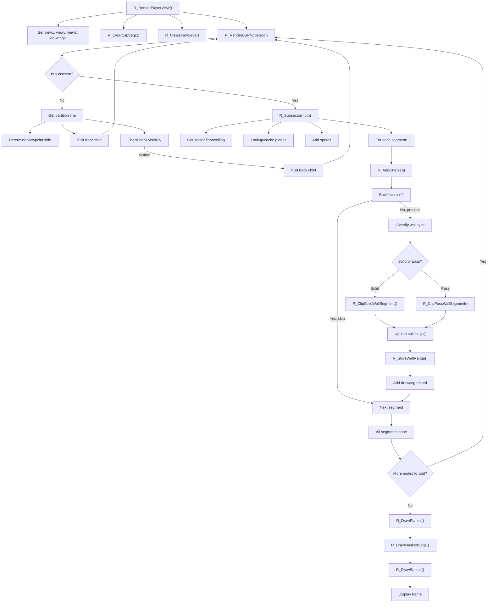

# BSP Runtime Flow

## High-Level Data Flow

```
Game Initialization
    ↓
P_SetupLevel(map_lump_index)
    │
    ├─ Load WAD lumps into runtime structures:
    │  ├─ P_LoadVertexes()        [VERTEXES]  → vertexes[]
    │  ├─ P_LoadLineDefs()        [LINEDEFS]  → lines[]
    │  ├─ P_LoadSideDefs()        [SIDEDEFS]  → sides[]
    │  ├─ P_LoadSectors()         [SECTORS]   → sectors[]
    │  ├─ P_LoadSegs()            [SEGS]      → segs[]
    │  ├─ P_LoadSubsectors()      [SSECTORS]  → subsectors[]
    │  ├─ P_LoadNodes()           [NODES]     → nodes[]
    │  ├─ P_LoadBlockMap()        [BLOCKMAP]  → blockmap[]
    │  └─ P_LoadReject()          [REJECT]    → rejectmatrix
    │
    └─ Post-processing:
       ├─ BuildSectorFromLines() (implied in setup)
       └─ InitializeThings()
```

## Map Lump Loading Process

### 1. Lump File Format Entry Points

**File**: `w_wad.c` / `w_wad.h`

All WAD data passes through:
- `W_CacheLumpNum(lumpnum, tag)` — Returns pointer to lump data in memory
- `W_LumpLength(lumpnum)` — Returns lump size in bytes

**File**: `p_setup.c`

Each `P_Load*` function:
1. Calls `W_LumpLength()` to determine the count of structures
2. Allocates zone memory via `Z_Malloc()` for runtime array
3. Calls `W_CacheLumpNum()` to get pointer to lump data
4. Iterates over the binary data, converting each on-disk structure to runtime format
5. Calls `Z_Free()` to release lump cache

### 2. On-Disk vs. Runtime Conversion

All WAD data is stored as 16-bit fixed-point. Runtime data uses 32-bit fixed-point.

**Example: P_LoadVertexes**

```c
// On disk: mapvertex_t (short x, y)
// At runtime: vertex_t (fixed_t x, y)

for (i=0; i<numvertexes; i++) {
    li->x = SHORT(ml->x) << FRACBITS;    // Convert 16-bit int to 32-bit fixed_t
    li->y = SHORT(ml->y) << FRACBITS;
    li++;
    ml++;
}
```

The `SHORT()` macro handles byte-swapping for endianness; `FRACBITS` (16) upscales the coordinate.

### 3. Cross-Reference Wiring

During loading, pointers between structures are established:

**In P_LoadSegs**:
```c
li->v1 = &vertexes[SHORT(ml->v1)];      // Index → pointer
li->v2 = &vertexes[SHORT(ml->v2)];
li->linedef = &lines[SHORT(ml->linedef)];
li->sidedef = &sides[ldef->sidenum[side]];
li->frontsector = sides[ldef->sidenum[side]].sector;
if (ldef->flags & ML_TWOSIDED)
    li->backsector = sides[ldef->sidenum[side^1]].sector;
```

After loading, the entire BSP tree and map are fully wired as a graph of pointers, ready for traversal.

### 4. Lump Order Dependencies

Lumps must be loaded in a specific order (defined in `doomdata.h` as `ML_*` enum):

| Order | Lump | Dependency | Why |
|-------|------|------------|-----|
| 1 | VERTEXES | None | Segments reference vertices |
| 2 | LINEDEFS | VERTEXES | Segments reference linedefs |
| 3 | SIDEDEFS | None | Linedefs reference sidedefs |
| 4 | SECTORS | None | Sidedefs reference sectors |
| 5 | SEGS | VERTEXES, LINEDEFS, SIDEDEFS, SECTORS | Segments reference all of the above |
| 6 | SSECTORS | SEGS | Subsectors reference segs |
| 7 | NODES | SSECTORS | Nodes reference subsectors |
| 8 | (ignored) | — | Not used for BSP |

**File**: `p_setup.c` references this order in `P_SetupLevel()`.

---

## Per-Frame BSP Traversal & Rendering

### 1. View Setup

**File**: `r_main.c`

Before rendering, `R_SetupFrame()` initializes:
```c
viewx = player->mo->x;
viewy = player->mo->y;
viewz = player->viewz;
viewangle = player->mo->angle + viewangleoffset;

// Precompute trig
viewcos = finecosine[viewangle >> ANGLETOFINESHIFT];
viewsin = finesine[viewangle >> ANGLETOFINESHIFT];

// Initialize angle-to-screen lookup tables
// (viewangletox[], xtoviewangle[])
```

These globals are used throughout BSP traversal to determine viewpoint relative to partition lines and to clip segments.

### 2. Screen Clipping Initialization

**File**: `r_bsp.c`

```c
R_ClearClipSegs() {
    solidsegs[0].first = -0x7fffffff;
    solidsegs[0].last = -1;
    solidsegs[1].first = viewwidth;
    solidsegs[1].last = 0x7fffffff;
    newend = solidsegs + 2;
}
R_ClearDrawSegs();  // ds_p = drawsegs;
```

This initializes the clip list to represent the entire screen as open (visible).

### 3. BSP Tree Traversal Entry Point

**File**: `r_bsp.c`

```c
R_RenderPlayerView() {
    // (from r_main.c via rend pipeline)
    R_ClearClipSegs();
    R_ClearDrawSegs();
    R_RenderBSPNode(numnodes - 1);  // Start at tree root (last node index)
}
```

The root node index is `numnodes - 1` (the nodes array is indexed 0 to numnodes-1; the root is typically the last).

### 4. Recursive BSP Traversal

**File**: `r_bsp.c`

```c
void R_RenderBSPNode(int bspnum) {
    node_t* bsp;
    int side;

    // Test for subsector leaf
    if (bspnum & NF_SUBSECTOR) {
        if (bspnum == -1)
            R_Subsector(0);
        else
            R_Subsector(bspnum & (~NF_SUBSECTOR));
        return;
    }

    bsp = &nodes[bspnum];

    // Determine which side of the partition the viewpoint is on
    side = R_PointOnSide(viewx, viewy, bsp);

    // Recursively render front space (closer to viewpoint)
    R_RenderBSPNode(bsp->children[side]);

    // Check if back space is visible (frustum culling)
    if (R_CheckBBox(bsp->bbox[side^1]))
        R_RenderBSPNode(bsp->children[side^1]);
}
```

**Key Points**:
- The `side` variable (0=front, 1=back) is determined by which side of the partition line the viewpoint lies.
- Front child is always visited; back child is visited only if `R_CheckBBox()` passes (not completely off-screen or blocked by solidsegs).
- This creates a front-to-back traversal order: everything closer to the viewpoint is rendered before farther geometry.

### 5. Subsector Processing

**File**: `r_bsp.c`

```c
void R_Subsector(int num) {
    subsector_t* sub = &subsectors[num];
    seg_t* line;

    frontsector = sub->sector;
    int count = sub->numlines;
    line = &segs[sub->firstline];

    // Determine planes for this sector
    if (frontsector->floorheight < viewz)
        floorplane = R_FindPlane(...);
    else
        floorplane = NULL;

    if (frontsector->ceilingheight > viewz || 
        frontsector->ceilingpic == skyflatnum)
        ceilingplane = R_FindPlane(...);
    else
        ceilingplane = NULL;

    // Add sprites in this sector
    R_AddSprites(frontsector);

    // Process all segments
    while (count--) {
        R_AddLine(line);
        line++;
    }
}
```

**Key Points**:
- A subsector references a single sector and a contiguous range of segments.
- Planes (floor/ceiling) are looked up/cached per unique height/texture/lightlevel.
- Segments from the subsector are processed to determine visible walls.
- Sprites are added (queued for later sorting and drawing).

### 6. Segment Processing & Clipping

**File**: `r_bsp.c` and `r_segs.c`

```c
void R_AddLine(seg_t* line) {
    // Convert segment endpoints to view angles
    angle_t angle1 = R_PointToAngle(line->v1->x, line->v1->y);
    angle_t angle2 = R_PointToAngle(line->v2->x, line->v2->y);

    // Check for backface culling (segment facing away from view)
    angle_t span = angle1 - angle2;
    if (span >= ANG180)
        return;

    // Clip to view frustum
    angle1 -= viewangle;
    angle2 -= viewangle;
    // (detailed clipping logic... convert angles to screen x coordinates)

    int x1 = viewangletox[...];
    int x2 = viewangletox[...];

    backsector = line->backsector;

    // Determine wall type
    if (!backsector)
        goto clipsolid;  // One-sided wall

    // Check for closed door or opaque wall
    if (backsector->ceilingheight <= frontsector->floorheight ||
        backsector->floorheight >= frontsector->ceilingheight)
        goto clipsolid;

    // Check for transparent window
    if (backsector->ceilingheight != frontsector->ceilingheight ||
        backsector->floorheight != frontsector->floorheight)
        goto clippass;

    // Reject empty lines (same ceiling, floor, light, no texture)
    if (backsector->ceilingpic == frontsector->ceilingpic &&
        backsector->floorpic == frontsector->floorpic &&
        backsector->lightlevel == frontsector->lightlevel &&
        curline->sidedef->midtexture == 0)
        return;

clippass:
    R_ClipPassWallSegment(x1, x2 - 1);  // Visible but doesn't block
    return;

clipsolid:
    R_ClipSolidWallSegment(x1, x2 - 1);  // Blocks screen
}
```

**Key Points**:
- Segments are classified as solid (one-sided or closed) or pass-through (windows).
- Solid segments block screen columns; pass-through segments are drawn but don't block.
- Empty lines (both sides identical) are skipped entirely.
- The clipping functions update `solidsegs[]` and call `R_StoreWallRange()` to register visible pieces.

### 7. Rendering Output

After BSP traversal completes:

```c
R_DrawPlanes();          // Render all cached floor/ceiling planes
R_DrawMaskedSegs();      // Render two-sided wall textures
R_DrawSprites();         // Render sprites (pre-sorted by BSP depth)
```

These functions consume the data registered during BSP traversal.

---

## Complete BSP Runtime Flow Diagram



---

## Key Distinctions

### Load-Time vs. Runtime

**Load-Time** (P_SetupLevel):
- All map structures are deserialized and wired as a graph
- BSP tree is static and never modified
- Blockmap is constructed
- All data is in memory, ready for gameplay

**Runtime** (per-frame):
- BSP tree is traversed afresh each frame
- Only visible geometry is processed
- Screen-space data (solidsegs[], drawsegs[]) is regenerated each frame
- Clip lists and planes are computed on-the-fly

### Rendering vs. Collision

**Rendering** (r_bsp.c, r_segs.c, r_plane.c, r_things.c):
- Uses BSP tree for traversal order and frustum culling
- Per-frame traversal from viewpoint
- Produces screen-space records (drawsegs, planes)

**Collision** (p_map.c, p_maputl.c):
- Uses blockmap for spatial acceleration
- Searches blocks for intersecting objects/walls
- Less directly tied to BSP, though bounding boxes and sector info are derived from BSP leaves

---

## Notes

- **Fixed-Point**: All coordinates use 32-bit fixed-point at runtime (16.16 format). The viewport position (viewx, viewy) is fixed-point.
- **Angle Representation**: Angles are represented as `angle_t` (typically `unsigned int`), where 2^32 = 360°.
- **State Variables**: Global variables in `r_bsp.c` (`curline`, `sidedef`, `linedef`, `frontsector`, `backsector`, `drawsegs[]`) maintain current segment/sector state during traversal.
- **Optimization**: Backface culling, bounding box checks, and frustum clipping prevent traversal of geometry that is definitely not visible, keeping rendering cost low.
