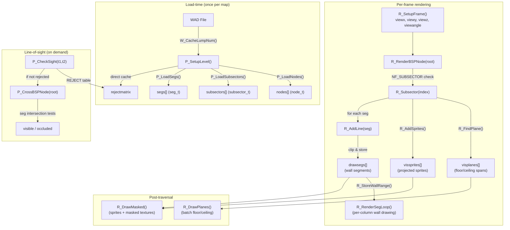

# 03 - BSP Runtime Flow

## How BSP data moves through the application

### 1. Map/WAD data enters the system

At startup, `W_InitMultipleFiles()` (`w_wad.c`) reads WAD file headers and builds the `lumpinfo[]` directory. Each lump is identified by an 8-character name and has a file handle, position, and size. Lump data is lazily cached via `W_CacheLumpNum()` using the zone memory allocator (`z_zone.c`).

When a map is loaded (e.g., "E1M1"), `P_SetupLevel()` (`p_setup.c`) calls `W_GetNumForName("E1M1")` to find the starting lump index, then loads map lumps in a fixed order using `lumpnum + ML_*` offsets.

### 2. Map lumps are loaded and decoded

`P_SetupLevel()` calls each loader in sequence:

1. **`P_LoadBlockMap()`** — Loads BLOCKMAP lump, endian-swaps shorts in-place, sets up `bmaporgx/y`, `bmapwidth/height`, allocates `blocklinks[]`.
2. **`P_LoadVertexes()`** — Casts lump to `mapvertex_t*`, converts each short `(x,y)` to `fixed_t` via `SHORT(x) << FRACBITS`, stores in `vertexes[]`.
3. **`P_LoadSectors()`** — Casts to `mapsector_t*`, converts heights to fixed-point, resolves flat texture names to indices.
4. **`P_LoadSideDefs()`** — Casts to `mapsidedef_t*`, converts offsets and resolves wall texture names.
5. **`P_LoadLineDefs()`** — Casts to `maplinedef_t*`, links vertices, computes `dx/dy/slopetype/bbox`, links sidedefs and sectors.
6. **`P_LoadSubsectors()`** — Casts to `mapsubsector_t*`, populates `subsectors[]` with `numlines`/`firstline` (indices into `segs[]`).
7. **`P_LoadNodes()`** — Casts to `mapnode_t*`, converts partition line `(x,y,dx,dy)` and bbox values to fixed-point via `<<FRACBITS`. Copies `children[]` as-is (preserving `NF_SUBSECTOR` bits). Stores in `nodes[]`.
8. **`P_LoadSegs()`** — Casts to `mapseg_t*`, links `v1/v2` to `vertexes[]`, `linedef` to `lines[]`, `sidedef` to `sides[]`, sets `angle` and `offset` (shifted by 16), sets `frontsector`/`backsector`.
9. **REJECT** — Loaded directly: `rejectmatrix = W_CacheLumpNum(lumpnum + ML_REJECT, PU_LEVEL)` (no loader function).
10. **`P_GroupLines()`** — Post-process: assigns `subsector->sector` (from first seg's sidedef sector), builds per-sector `lines[]` arrays, computes sector bounding boxes and blockmap indices.
11. **`P_LoadThings()`** — Loads and spawns map things (not BSP-related).

Each loader follows the same pattern: `W_CacheLumpNum()` → cast to `map*_t*` → loop with `SHORT()` + `<<FRACBITS` → `Z_Free(data)` (or keep for BLOCKMAP/REJECT).

### 3. BSP nodes/subsectors/segs in memory — key globals

After loading, the following global arrays exist (declared in `p_setup.c`, `extern` in `r_state.h`):

| Global | Type | Count |
|---|---|---|
| `nodes` | `node_t*` | `numnodes` |
| `subsectors` | `subsector_t*` | `numsubsectors` |
| `segs` | `seg_t*` | `numsegs` |
| `vertexes` | `vertex_t*` | `numvertexes` |
| `lines` | `line_t*` | `numlines` |
| `sides` | `side_t*` | `numsides` |
| `sectors` | `sector_t*` | `numsectors` |

The BSP root node is at `nodes[numnodes - 1]`. Children are resolved as:
- If `children[i] & NF_SUBSECTOR` → `subsectors[children[i] & ~NF_SUBSECTOR]`
- Otherwise → `nodes[children[i]]`

Subsectors reference segs via `segs[firstline]` through `segs[firstline + numlines - 1]`.

### 4. How traversal is initiated

**Rendering traversal** — each frame:
- `R_RenderPlayerView()` (`r_main.c`) calls `R_SetupFrame()` to set `viewx`, `viewy`, `viewz`, `viewangle`, `viewsin`, `viewcos` from the player's position.
- Clears clip arrays, drawsegs, visplanes, sprites.
- Calls `R_RenderBSPNode(numnodes - 1)` — starts at the root node.

**Line-of-sight traversal** — on demand:
- `P_CheckSight(t1, t2)` (`p_sight.c`) first checks the REJECT table.
- If not rejected, calls `P_CrossBSPNode(numnodes - 1)` to do a precise BSP-based occlusion test.

**Point-in-subsector lookup** — on demand:
- `R_PointInSubsector(x, y)` (`r_main.c`) traverses from root: `while (!(nodenum & NF_SUBSECTOR))` pick side via `R_PointOnSide()`, follow child. Returns `&subsectors[nodenum & ~NF_SUBSECTOR]`.
- Used by `P_SetThingPosition()` to link mobjs to subsectors.

### 5. How traversal results affect other systems

| Traversal result | Consumer | Effect |
|---|---|---|
| `drawsegs[]` (wall segments) | `r_things.c` | Sprite per-column clipping against wall silhouettes |
| `drawsegs[]` | `r_things.c` | Masked midtexture rendering order |
| `visplanes[]` (floor/ceiling spans) | `r_plane.c` | Batched horizontal span drawing after traversal |
| `vissprites[]` (projected sprites) | `r_things.c` | Sorted back-to-front, drawn after visplanes |
| `solidsegs[]` (clip ranges) | `r_bsp.c` / `r_segs.c` | Occlusion culling: later segs clipped by earlier ones |
| `floorclip[]` / `ceilingclip[]` | `r_plane.c`, `r_things.c` | Per-column vertical drawn-extent tracking |
| `openings[]` | `r_things.c` | Sprite clipping data saved per-drawseg column |

### 6. Differences between load-time, runtime, and per-frame

- **Load-time** (once per map): `P_SetupLevel()` loads all BSP data into `nodes[]`, `subsectors[]`, `segs[]`. These arrays persist for the level's lifetime.
- **Per-frame** (every rendered frame): `R_RenderBSPNode()` traverses the persistent BSP arrays. Creates transient `drawsegs[]`, `visplanes[]`, `vissprites[]`, `solidsegs[]`. These are cleared at the start of each frame.
- **Runtime queries** (on demand): `R_PointInSubsector()` and `P_CheckSight()` traverse the persistent BSP arrays without creating transient data.

---

## Mermaid: BSP Runtime Flow

