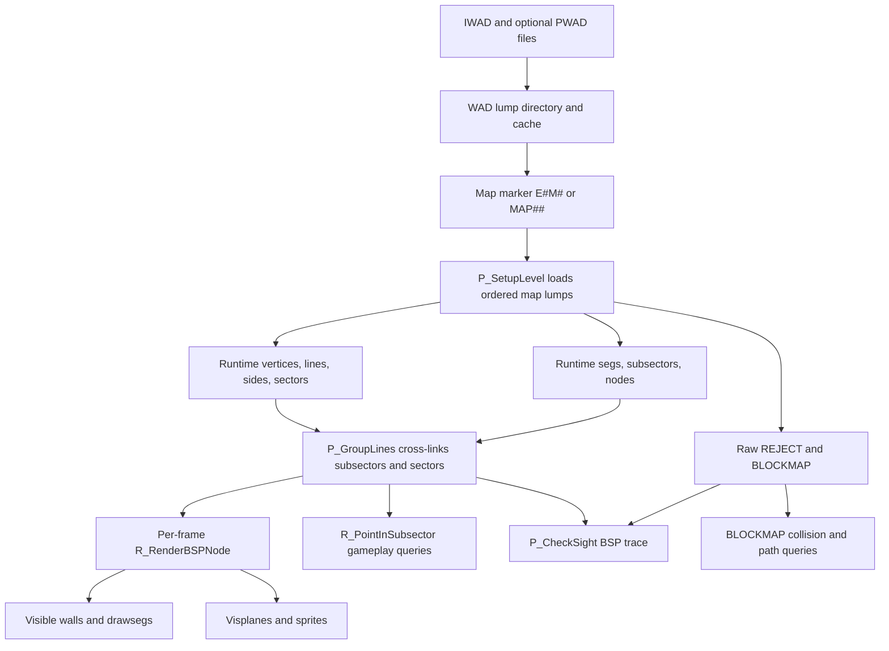

# BSP runtime flow

## Load-time flow

BSP bytes enter through the common WAD layer. `D_DoomMain` selects an IWAD based on `DOOMWADDIR` and accepts later PWADs through `-file`; `W_InitMultipleFiles` builds a global lump directory in which later files override earlier matching names.

When gameplay enters a level, `G_DoLoadLevel` calls `P_SetupLevel`. Setup derives an `E#M#` or `MAP##` marker, then uses fixed `ML_*` offsets after that marker. The ordering in `doomdata.h` is therefore a hard format assumption.

The important load dependencies are:

- Vertices before linedefs and segs.
- Sectors before sidedefs.
- Sidedefs before linedefs and segs.
- Linedefs before segs.
- Subsectors and nodes can be decoded before segs, but `P_GroupLines` must run after segs to assign subsector sectors.

Each loader determines record count from lump byte length, allocates `PU_LEVEL` runtime arrays, byte-swaps fields, and expands coordinates/heights to 16.16 fixed point. Temporary cached source bytes use `PU_STATIC` and are freed after conversion; raw `REJECT` and `BLOCKMAP` data remain cached for the level.

## In-memory interpretation

The runtime representation replaces most indexes with pointers:

- Seg vertex indexes become `vertex_t*`.
- A seg's linedef/side selection becomes `line_t*` and `side_t*`.
- Sides and lines point to sectors.
- Each subsector stores a range into the global `segs` array and gains a sector pointer during grouping.
- Nodes retain child indexes because their high bit distinguishes nodes from subsectors.

All level geometry is global and level-lifetime. Entering another level frees `PU_LEVEL` allocations and rebuilds these arrays.

## Per-frame rendering flow

`R_RenderPlayerView` establishes camera coordinates, resets solid clipping, drawsegs, planes, and sprites, then calls `R_RenderBSPNode(numnodes - 1)`.

At each internal node:

- `R_PointOnSide` chooses the child containing the camera.
- That child is rendered first, allowing near solid walls to extend the horizontal clip list.
- `R_CheckBBox` projects the opposite child's bounding box and skips it if its screen range is outside the view or already fully covered.

At each subsector, `R_Subsector` selects floor/ceiling visplanes, adds sector sprites, and submits every seg to wall clipping/drawing. After traversal, planes and masked content/sprites are drawn from the accumulated renderer products.

## Runtime gameplay use

Two gameplay paths use BSP data directly:

- `R_PointInSubsector` locates a point's leaf and sector. Object placement links things into that sector, while movement checks use its floor and ceiling as the base vertical bounds.
- `P_CheckSight` uses the objects' subsector sectors to query `REJECT`; if not rejected, it recursively crosses only BSP branches touched by the sight trace and tests subsector linedefs/openings.

Movement collision, hitscan/use traces, and most line/thing candidate collection instead step through `BLOCKMAP` cells. They share map geometry with the BSP but do not traverse `node_t`.

## BSP data/use flow

## Load-time versus runtime versus per-frame

| Phase | BSP activity |
|---|---|
| Process startup | WAD files are selected; lump directory/cache is initialized. No map BSP is decoded yet. |
| Level load/reload | Packed lumps are decoded, arrays allocated, references linked, subsector sectors assigned, `REJECT`/`BLOCKMAP` cached. |
| Game ticks | Point-to-subsector queries and line-of-sight checks use the loaded tree when needed. |
| Render frame | The whole potentially visible tree is traversed front-to-back, with child-bounding-box pruning and screen clipping. |
| Level exit/change | Zone allocations tagged `PU_LEVEL` are freed and replaced by the next map's data. |
