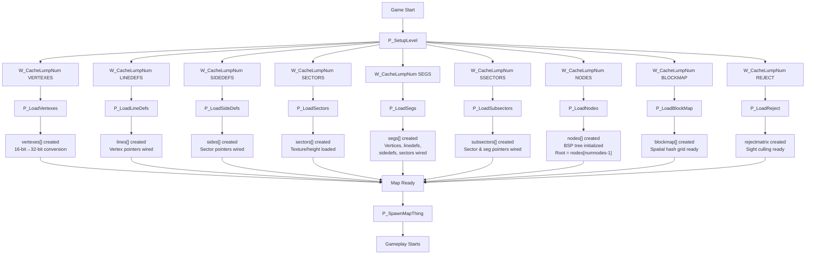
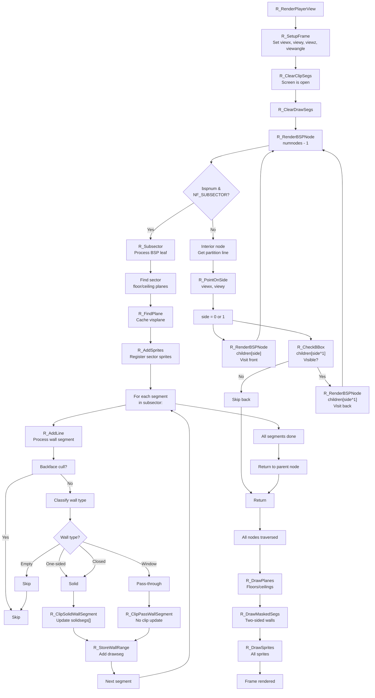
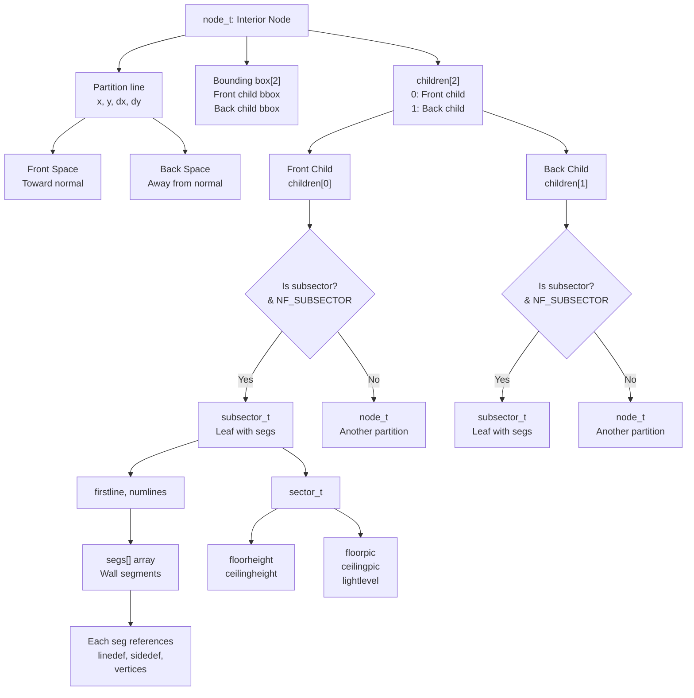
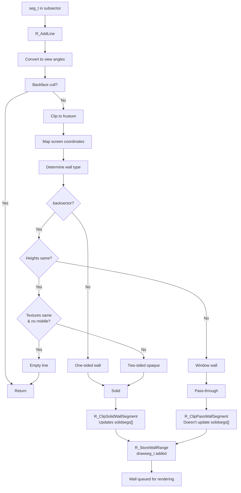
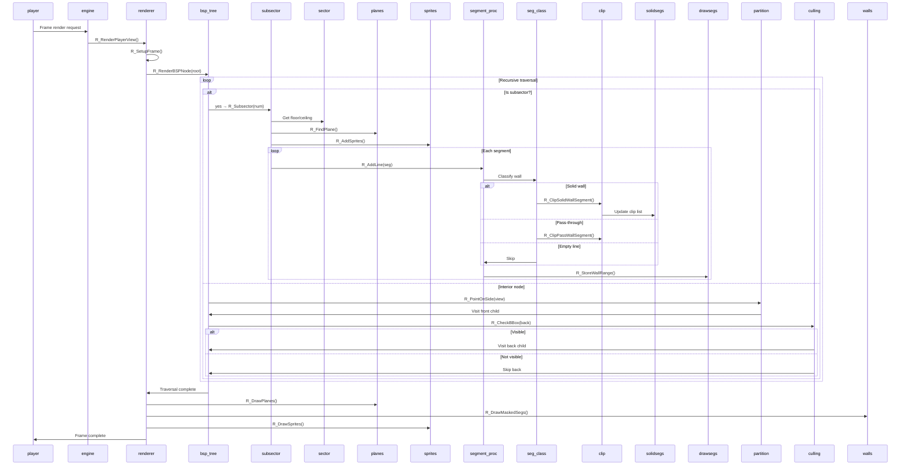
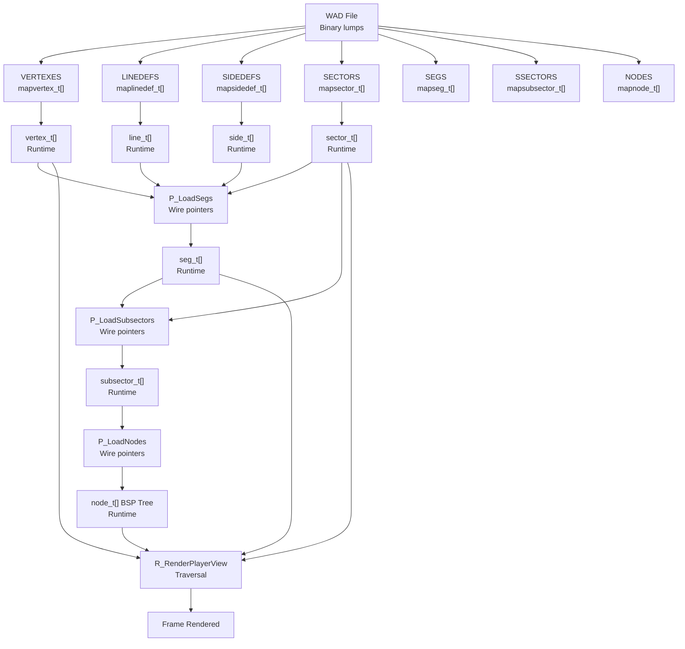

# Diagrams

## Diagram 1: BSP Data Loading Flow



---

## Diagram 2: BSP Runtime Traversal & Rendering Flow



---

## Diagram 3: BSP Node Structure & Children Relationships



---

## Diagram 4: Segment Classification & Clipping



---

## Diagram 5: Sequence: Frame Rendering from Viewpoint



---

## Diagram 6: Data Dependency Graph



---

## Diagram 7: Coordinate Spaces

```
World Space (map units, fixed-point 32-bit)
    ↓
View Space (relative to viewpoint, angles computed)
    ↓
Angle Space (0 to 2^32 = 360°)
    ↓
Screen Space (pixel column 0 to screenwidth-1)

Example transformation:
  World: vertex at x=12800 (fixed_t)
  View: relative to viewx=8192, angle=0
    → dx = 12800 - 8192 = 4608
  Angle: angle_t = R_PointToAngle(12800, vy)
    → angle_t result
  Screen: x = viewangletox[angle_index]
    → screen column (e.g., 150)
```

---

## Diagram 8: Memory Layout

```
Global Arrays (from doomstat):
  vertexes[numvertexes]     ← vertex_t
  lines[numlines]           ← line_t
  sides[numsides]           ← side_t
  sectors[numsectors]       ← sector_t
  segs[numsegs]             ← seg_t
  subsectors[numsubsectors] ← subsector_t
  nodes[numnodes]           ← node_t
  blockmap[]                ← spatial hash
  rejectmatrix[]            ← visibility lookup

Stack (frame-based):
  solidsegs[MAXSEGS]        ← Clip ranges
  drawsegs[MAXDRAWSEGS]     ← Draw records
  visplanes[MAXVISPLANES]   ← Plane cache
  vissprites[]              ← Sprite records

Heap (zone allocator):
  Various textures, sprites, misc objects
```

---

## Notes on Diagrams

- **Diagram 1** shows the initialization order and dependencies for BSP loading.
- **Diagram 2** is the main rendering loop; follows BSP traversal front-to-back.
- **Diagram 3** illustrates the tree structure and how nodes/subsectors are related.
- **Diagram 4** shows segment classification logic (the most complex part of rendering).
- **Diagram 5** is a sequence diagram showing the call order and interactions during frame rendering.
- **Diagram 6** shows data dependencies between WAD lumps and runtime structures.
- **Diagram 7** illustrates coordinate space transformations (world → screen).
- **Diagram 8** shows memory layout and global structures.

All diagrams are intended to be high-level; line-by-line code details are intentionally omitted.
