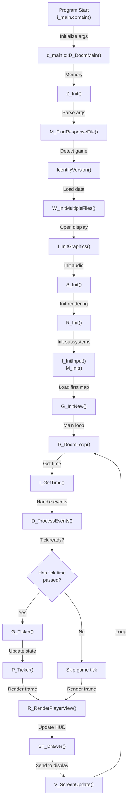
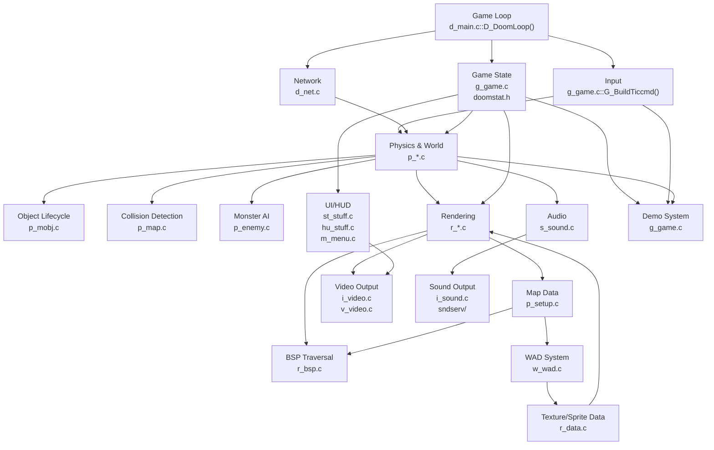
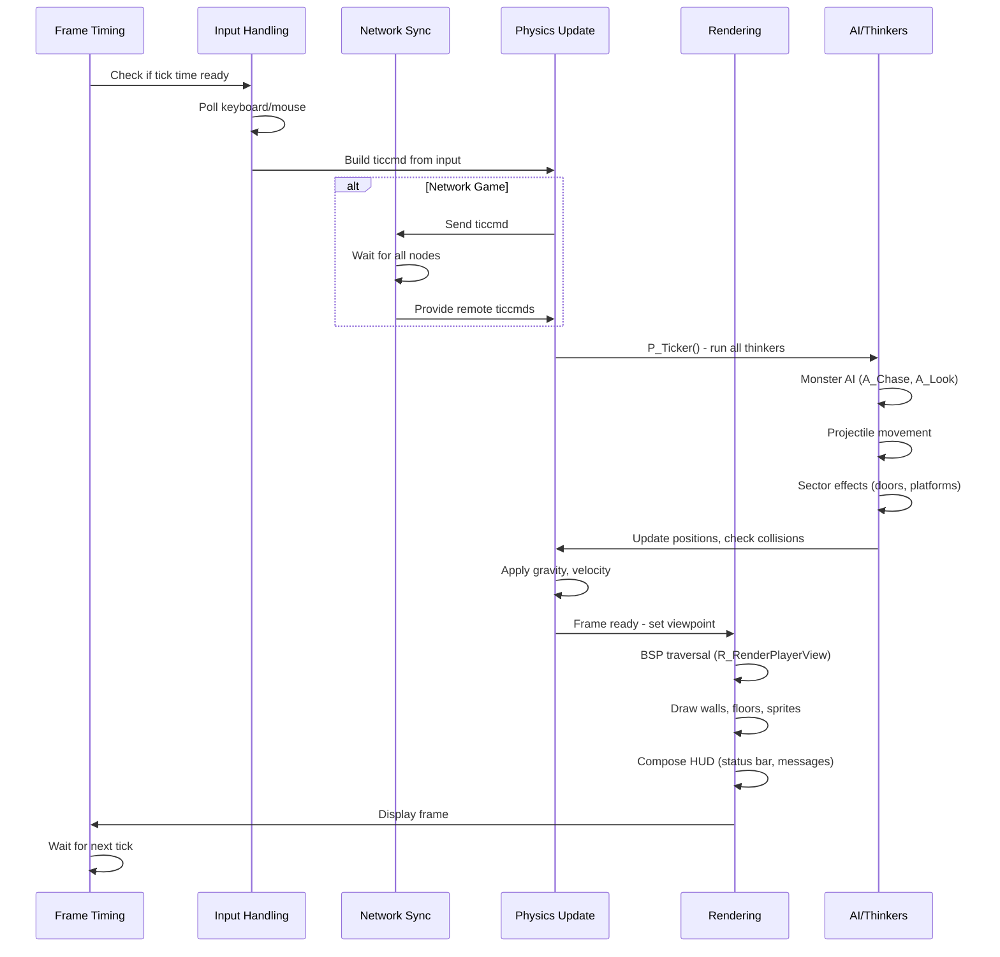
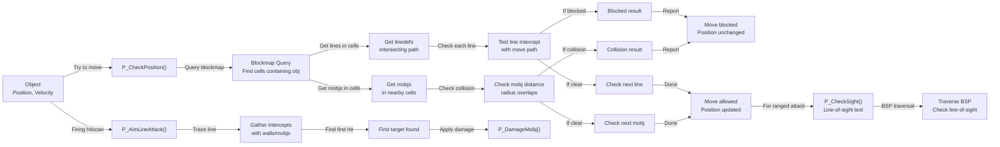
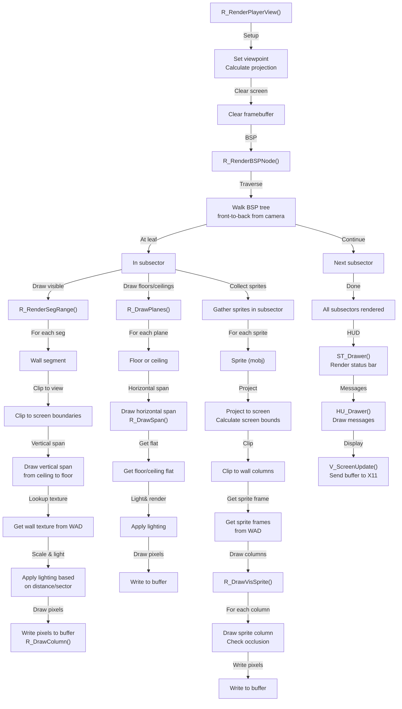
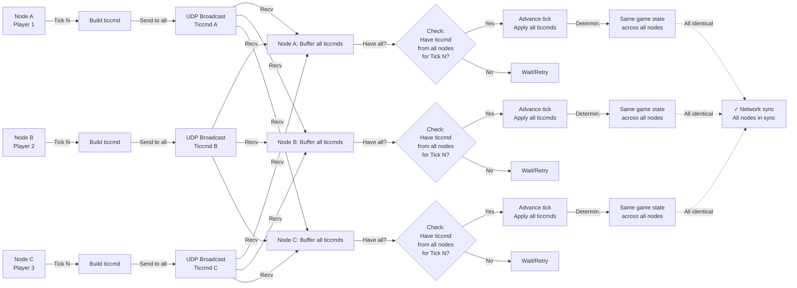

# Diagrams

This section contains Mermaid diagrams illustrating the architecture and key flows of the DOOM engine.

---

## Diagram 1: Runtime Flow (High-Level)

Shows the complete flow from program start to main game loop.



---

## Diagram 2: Module Interaction (Core Subsystems)

Shows how major subsystems interact.



---

## Diagram 3: Game Tick Sequence

Shows what happens during a single game tick (35 Hz, ~28 ms).



---

## Diagram 4: Physics and Collision Query

Shows how collision detection and physics queries work.



---

## Diagram 5: Monster AI State Machine

Shows how a monster transitions through behavioral states.

```mermaid
stateDiagram-v2
    [*] --> Idle
    
    Idle -->|See player| Chase
    Idle -->|Hear sound| Alert
    Alert -->|See player| Chase
    Alert -->|No player| Idle
    
    Chase -->|In melee range| Melee
    Chase -->|In ranged range| Ranged
    Chase -->|Lost player| Idle
    
    Melee -->|Attack ready| Punch
    Punch -->|Attacked| Chase
    Punch -->|Lost player| Idle
    
    Ranged -->|Projectile ready| Fire
    Fire -->|Fired| Chase
    Fire -->|Lost player| Idle
    
    Chase -->|Take damage| Pain
    Pain -->|Recover| Chase
    
    Chase -->|Health <= 0| Die
    Melee -->|Health <= 0| Die
    Ranged -->|Health <= 0| Die
    Idle -->|Health <= 0| Die
    
    Die --> [*]
    
    note right of Chase
        P_MapThings.A_Chase()
        Calculates direction to player
        Tries to move closer
        Plays animation frame
    end
    
    note right of Fire
        P_Enemy.A_BruiserAttack() etc.
        P_SpawnMissile() spawns projectile
        Projectile thinker runs each tick
    end
```

---

## Diagram 6: Rendering Pipeline

Shows the complete rendering flow from world space to screen pixels.



---

## Diagram 7: Network Synchronization

Shows how networked games stay in sync.



---

## Diagram 8: Memory Architecture

Shows how memory is organized and managed.

```mermaid
graph TD
    Heap["System Heap (malloc)"]
    
    Heap -->|Z_Init()| Zone["Zone Allocator<br/>z_zone.c"]
    
    Zone -->|Allocate| MainZone["Main Zone<br/>Fixed size buffer"]
    
    MainZone -->|W_InitMultipleFiles()| WADCache["WAD Cache<br/>Game data"]
    MainZone -->|R_Init()| ScreenBuf["Screen Buffer<br/>320x200 pixels"]
    MainZone -->|R_Init()| Textures["Texture Cache<br/>All textures"]
    MainZone -->|R_Init()| Sprites["Sprite Cache<br/>All sprites"]
    MainZone -->|P_LoadThings()| MapData["Map Data<br/>Sectors, linedefs"]
    MainZone -->|G_InitNew()| Mobjs["Active Mobjs<br/>Players, monsters"]
    
    WADCache -->|Lookup| Lumps["Lump Directory"]
    Lumps -->|Read| Lump1["Lump 1<br/>Map data"]
    Lumps -->|Read| Lump2["Lump 2<br/>Sprite data"]
    Lumps -->|Read| LumpN["Lump N<br/>..."]
    
    MapData -->|Contains| Vertexes["Vertices"]
    MapData -->|Contains| Linedefs["Linedefs"]
    MapData -->|Contains| Sectors["Sectors"]
    MapData -->|Contains| Things["Things<br/>spawn points"]
    
    Mobjs -->|Contains| Player["Player 1-4"]
    Mobjs -->|Contains| Monsters["Monsters"]
    Mobjs -->|Contains| Projectiles["Projectiles"]
    Mobjs -->|Contains| Pickups["Pickups"]
    
    ScreenBuf -->|320x200x1| Pixels["8-bit pixels<br/>palette indices"]
```

---

## Diagram 9: WAD File System

Shows how the WAD file system is organized and accessed.

```mermaid
graph LR
    Game["Game Start<br/>main()"]
    Game -->|Find& load| IWAD["IWAD<br/>DOOM.WAD or DOOM2.WAD<br/>~2-4 MB"]
    Game -->|Optional| PWAD1["PWAD 1<br/>Mod/addon<br/>~100 KB"]
    Game -->|Optional| PWAD2["PWAD 2<br/>Mod/addon<br/>~200 KB"]
    
    IWAD -->|W_AddFile()| Directory["Master Lump Directory<br/>All WAD files merged"]
    PWAD1 -->|W_AddFile()| Directory
    PWAD2 -->|W_AddFile()| Directory
    
    Directory -->|Hash table| Lookup["Fast O(1) Lump Lookup<br/>W_CheckNumForName()"]
    
    Lookup -->|By name| Map["MAP01 lump<br/>Map data"]
    Lookup -->|By name| Sprite["TROOA0 lump<br/>Sprite frame"]
    Lookup -->|By name| Texture["STARTAN1 lump<br/>Wall texture"]
    Lookup -->|By name| Flat["STONE lump<br/>Floor/ceiling"]
    Lookup -->|By name| Sound["DSPISTOL lump<br/>Sound data"]
    Lookup -->|By name| Palette["PLAYPAL lump<br/>Color palette"]
    
    Map -->|P_LoadLevel()| MapData["Parse map data<br/>Create world geometry"]
    Sprite -->|R_InitSprites()| SpriteCache["Load into memory<br/>Cache sprites"]
    Texture -->|R_InitTextures()| TexCache["Load into memory<br/>Cache textures"]
    Flat -->|R_InitFlats()| FlatCache["Load into memory<br/>Cache flats"]
    Sound -->|S_Init()| SoundCache["Load sound data<br/>or pass to sndserv"]
    Palette -->|I_InitGraphics()| PalInit["Initialize palette<br/>X11 colormap"]
```

---

## Diagram 10: Player Input to Action

Shows how keyboard/mouse input becomes in-game action.

```mermaid
graph LR
    Keyboard["Keyboard Event<br/>e.g., 'W' key pressed"]
    Mouse["Mouse Event<br/>e.g., button click"]
    
    Keyboard -->|X11 event| EventQueue["Event Queue"]
    Mouse -->|X11 event| EventQueue
    
    EventQueue -->|D_ProcessEvents()| Dispatch["Dispatch events to handlers"]
    
    Dispatch -->|Key event| KeyBind["Lookup key binding<br/>from config"]
    Dispatch -->|Mouse event| MouseBind["Lookup mouse binding"]
    
    KeyBind -->|Map to action| Forward["Forward movement"]
    KeyBind -->|Map to action| Turn["Turn"]
    KeyBind -->|Map to action| Fire["Fire weapon"]
    KeyBind -->|Map to action| Use["Use item"]
    
    MouseBind -->|Map to action| Look["Look/aim"]
    MouseBind -->|Map to action| MFire["Fire weapon"]
    
    Forward -->|G_BuildTiccmd()| Ticcmd["Build ticcmd<br/>Tick command"]
    Turn -->|G_BuildTiccmd()| Ticcmd
    Fire -->|G_BuildTiccmd()| Ticcmd
    Use -->|G_BuildTiccmd()| Ticcmd
    Look -->|G_BuildTiccmd()| Ticcmd
    MFire -->|G_BuildTiccmd()| Ticcmd
    
    Ticcmd -->|Network/Local| Execute["Execute ticcmd"]
    Execute -->|P_Ticker()| Action["Apply action in game"]
    Action -->|Forward→| Move["Move player forward"]
    Action -->|Turn→| Rotate["Rotate player view"]
    Action -->|Fire→| Weapon["Fire current weapon"]
    Action -->|Use→| Interact["Interact with world"]
```

These diagrams provide visual understanding of the system's architecture, data flow, and key algorithms. They complement the textual documentation in the other files.
