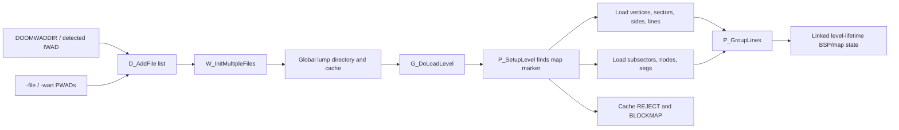
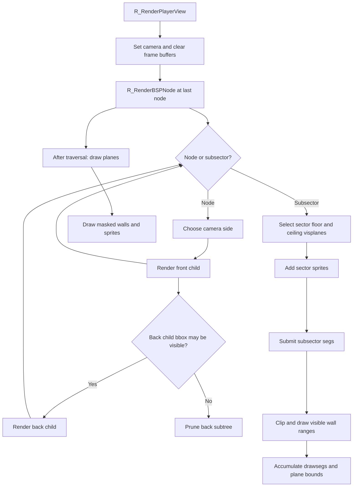
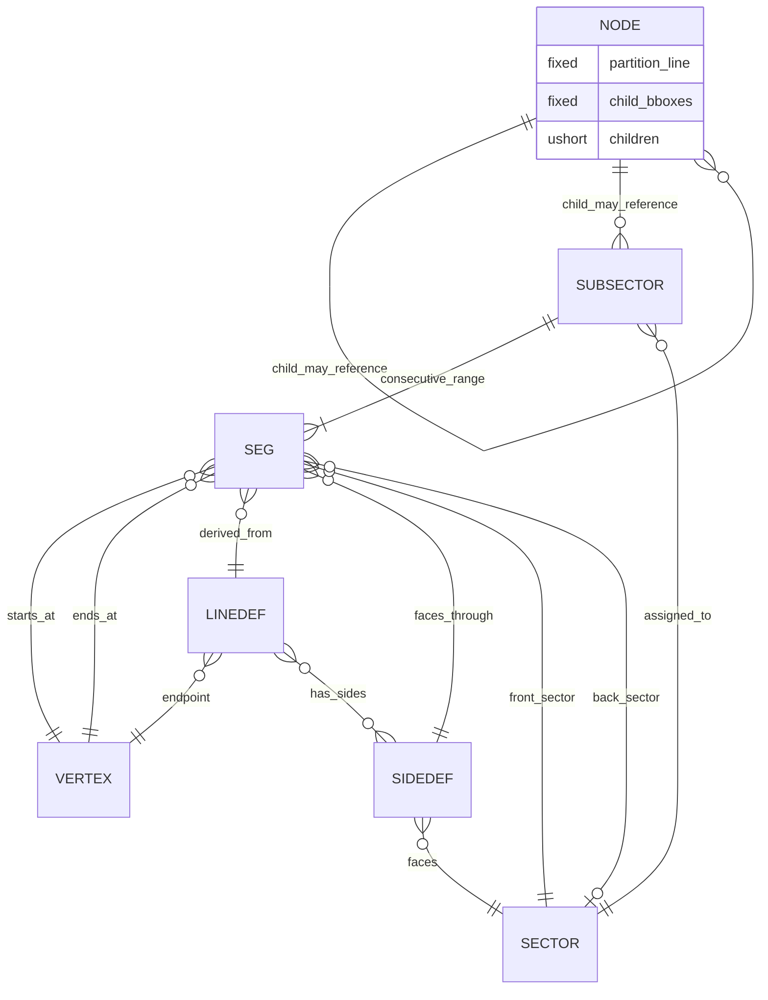
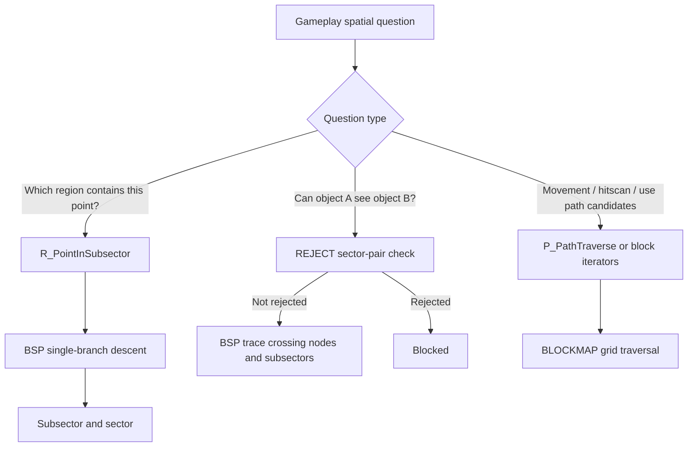

# BSP usage diagrams

## 1. BSP data loading flow



## 2. BSP runtime traversal and rendering flow



## 3. Key BSP/map structure relationships



`NODE` child relationships are encoded indexes, while most seg/map relationships are resolved to pointers at load time.

## 4. Sequence: render a player view through the BSP

```mermaid
sequenceDiagram
    participant Loop as Display loop
    participant Main as r_main.c
    participant BSP as r_bsp.c
    participant Segs as r_segs.c
    participant Planes as r_plane.c
    participant Things as r_things.c

    Loop->>Main: R_RenderPlayerView(player)
    Main->>Main: Set camera; clear clips, drawsegs, planes, sprites
    Main->>BSP: R_RenderBSPNode(root = numnodes - 1)
    loop Internal nodes
        BSP->>BSP: Choose viewer side and visit front child
        BSP->>BSP: Check opposite child bounding box against view/solid clips
    end
    loop Reached subsectors
        BSP->>Planes: Find floor and ceiling visplanes
        BSP->>Things: Add sprites from subsector sector
        BSP->>BSP: Add each seg and clip its screen range
        BSP->>Segs: Store/render visible wall ranges
        Segs->>Planes: Mark visible plane ranges
    end
    Main->>Planes: R_DrawPlanes()
    Main->>Things: R_DrawMasked() for masked walls and sprites
```

## 5. Gameplay spatial-query split


