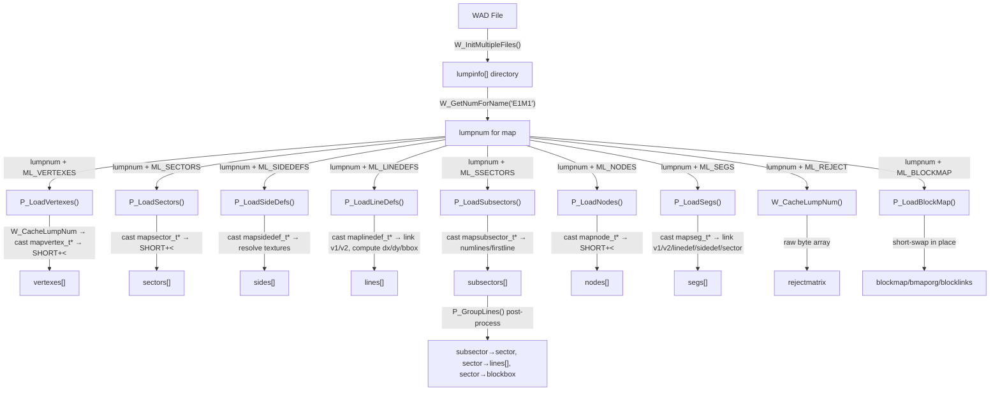
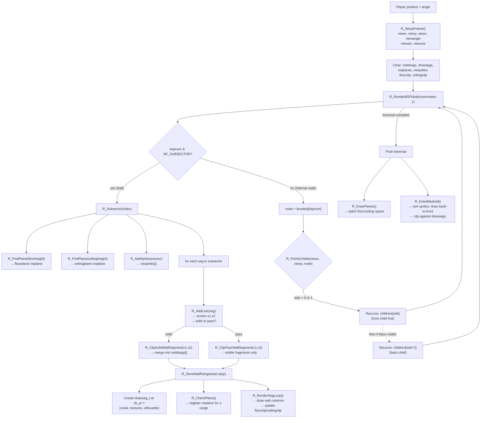
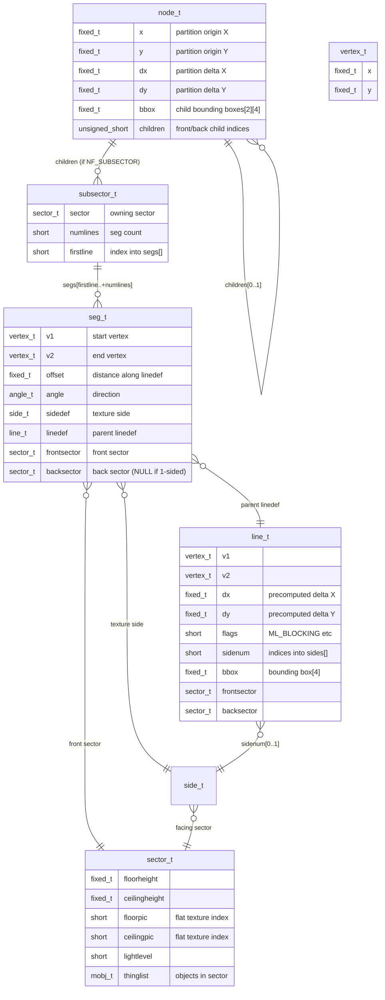
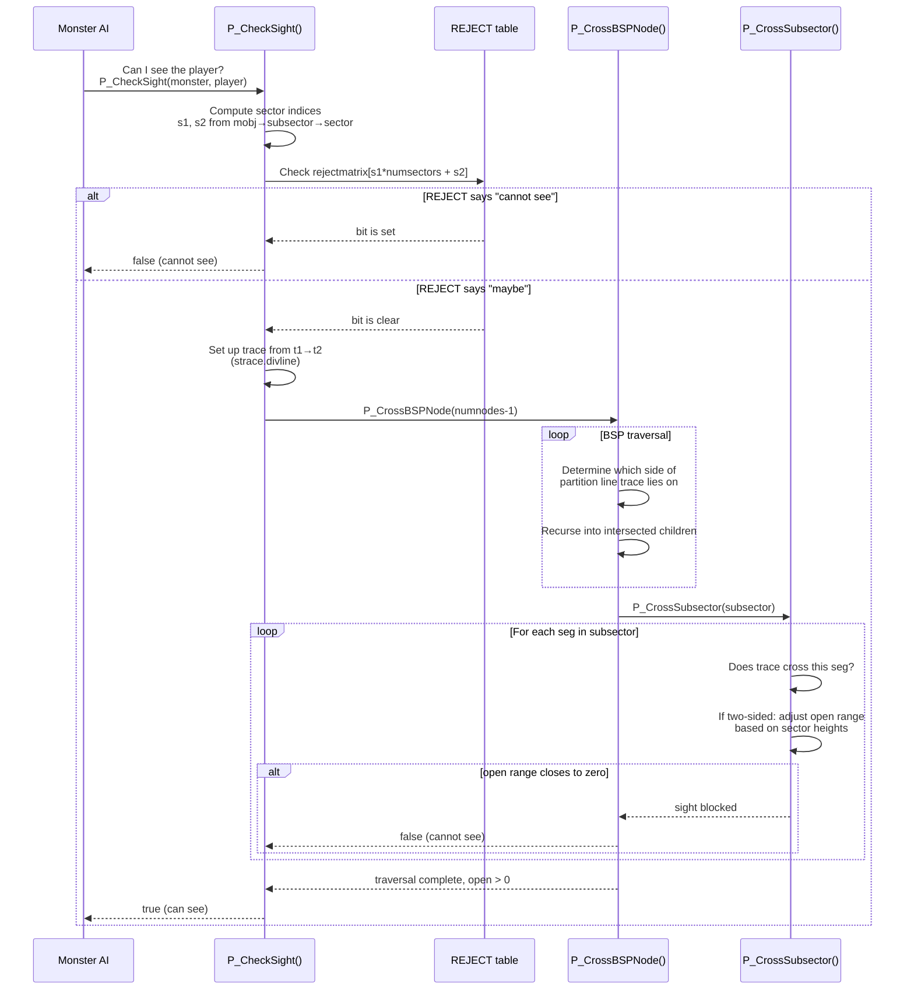

# 08 - BSP Diagrams

## 1. BSP Data Loading Flow

```mermaid
flowchart TD
    WAD["WAD File"] -->|"W_InitMultipleFiles()"| DIR["lumpinfo[] directory"]
    DIR -->|"W_GetNumForName('E1M1')"| START["lumpnum for map"]
    
    START -->|"lumpnum + ML_VERTEXES"| V["P_LoadVertexes()"]
    START -->|"lumpnum + ML_SECTORS"| SEC["P_LoadSectors()"]
    START -->|"lumpnum + ML_SIDEDEFS"| SD["P_LoadSideDefs()"]
    START -->|"lumpnum + ML_LINEDEFS"| LD["P_LoadLineDefs()"]
    START -->|"lumpnum + ML_SSECTORS"| SS["P_LoadSubsectors()"]
    START -->|"lumpnum + ML_NODES"| ND["P_LoadNodes()"]
    START -->|"lumpnum + ML_SEGS"| SG["P_LoadSegs()"]
    START -->|"lumpnum + ML_REJECT"| RJ["W_CacheLumpNum()"]
    START -->|"lumpnum + ML_BLOCKMAP"| BM["P_LoadBlockMap()"]
    
    V -->|"W_CacheLumpNum → cast mapvertex_t* → SHORT+<<FRACBITS"| VARRAYS["vertexes[]"]
    SEC -->|"cast mapsector_t* → SHORT+<<FRACBITS"| SARRAYS["sectors[]"]
    SD -->|"cast mapsidedef_t* → resolve textures"| SIARRAYS["sides[]"]
    LD -->|"cast maplinedef_t* → link v1/v2, compute dx/dy/bbox"| LARRAYS["lines[]"]
    SS -->|"cast mapsubsector_t* → numlines/firstline"| SUARRAYS["subsectors[]"]
    ND -->|"cast mapnode_t* → SHORT+<<FRACBITS on x/y/dx/dy/bbox"| NARRAYS["nodes[]"]
    SG -->|"cast mapseg_t* → link v1/v2/linedef/sidedef/sector"| SEARRAYS["segs[]"]
    RJ -->|"raw byte array"| RMATRIX["rejectmatrix"]
    BM -->|"short-swap in place"| BMAP["blockmap/bmaporg/blocklinks"]

    SUARRAYS -->|"P_GroupLines() post-process"| LINK["subsector→sector, sector→lines[], sector→blockbox"]
```

## 2. BSP Runtime Traversal & Rendering Flow

```mermaid
flowchart TD
    PLAYER["Player position + angle"] --> SETUP["R_SetupFrame()<br/>viewx, viewy, viewz, viewangle<br/>viewsin, viewcos"]
    
    SETUP --> INIT["Clear: solidsegs, drawsegs,<br/>visplanes, vissprites,<br/>floorclip, ceilingclip"]
    
    INIT --> ROOT["R_RenderBSPNode(numnodes-1)"]
    
    ROOT --> CHECK{"bspnum & NF_SUBSECTOR?"}
    
    CHECK -->|"yes (leaf)"| SUBSEC["R_Subsector(index)"]
    CHECK -->|"no (internal node)"| NODE["node = &nodes[bspnum]"]
    
    NODE --> SIDE{"R_PointOnSide(viewx, viewy, node)"}
    SIDE -->|"side = 0 or 1"| FRONT["Recurse: children[side]<br/>(front child first)"]
    FRONT --> ROOT
    
    FRONT -.->|"then if bbox visible"| BACK["Recurse: children[side^1]<br/>(back child)"]
    BACK --> ROOT
    
    SUBSEC --> FLOOR["R_FindPlane(floorheight)<br/>→ floorplane visplane"]
    SUBSEC --> CEILING["R_FindPlane(ceilingheight)<br/>→ ceilingplane visplane"]
    SUBSEC --> SPRITES["R_AddSprites(sector)<br/>→ vissprites[]"]
    SUBSEC --> SEGLOOP["for each seg in subsector"]
    
    SEGLOOP --> ADDLINE["R_AddLine(seg)<br/>→ screen x1,x2<br/>→ solid or pass?"]
    
    ADDLINE -->|"solid"| CLIPSOLID["R_ClipSolidWallSegment(x1,x2)<br/>→ merge into solidsegs[]"]
    ADDLINE -->|"pass"| CLIPPASS["R_ClipPassWallSegment(x1,x2)<br/>→ visible fragments only"]
    
    CLIPSOLID --> STORE["R_StoreWallRange(start,stop)"]
    CLIPPASS --> STORE
    
    STORE --> DRAWSEG["Create drawseg_t at ds_p++<br/>(scale, textures, silhouette)"]
    STORE --> PLANE["R_CheckPlane()<br/>→ register visplane for x-range"]
    STORE --> LOOP["R_RenderSegLoop()<br/>→ draw wall columns<br/>→ update floorclip/ceilingclip"]
    
    ROOT -->|"traversal complete"| POST["Post-traversal"]
    POST --> DRAWPLANES["R_DrawPlanes()<br/>→ batch floor/ceiling spans"]
    POST --> DRAWMASKED["R_DrawMasked()<br/>→ sort sprites, draw back-to-front<br/>→ clip against drawsegs"]
```

## 3. Key BSP/Map Structure Relationships

```mermaid
erDiagram
    node_t ||--o{ node_t : "children[0..1]"
    node_t ||--o{ subsector_t : "children (if NF_SUBSECTOR)"
    
    node_t {
        fixed_t x "partition origin X"
        fixed_t y "partition origin Y"
        fixed_t dx "partition delta X"
        fixed_t dy "partition delta Y"
        fixed_t bbox "child bounding boxes[2][4]"
        unsigned_short children "front/back child indices"
    }
    
    subsector_t {
        sector_t sector "owning sector"
        short numlines "seg count"
        short firstline "index into segs[]"
    }
    
    subsector_t ||--o{ seg_t : "segs[firstline..+numlines]"
    
    seg_t {
        vertex_t v1 "start vertex"
        vertex_t v2 "end vertex"
        fixed_t offset "distance along linedef"
        angle_t angle "direction"
        side_t sidedef "texture side"
        line_t linedef "parent linedef"
        sector_t frontsector "front sector"
        sector_t backsector "back sector (NULL if 1-sided)"
    }
    
    seg_t }o--|| line_t : "parent linedef"
    seg_t }o--|| side_t : "texture side"
    seg_t }o--|| sector_t : "front sector"
    
    line_t {
        vertex_t v1
        vertex_t v2
        fixed_t dx "precomputed delta X"
        fixed_t dy "precomputed delta Y"
        short flags "ML_BLOCKING etc"
        short sidenum "indices into sides[]"
        fixed_t bbox "bounding box[4]"
        sector_t frontsector
        sector_t backsector
    }
    
    line_t }o--|| side_t : "sidenum[0..1]"
    side_t }o--|| sector_t : "facing sector"
    
    sector_t {
        fixed_t floorheight
        fixed_t ceilingheight
        short floorpic "flat texture index"
        short ceilingpic "flat texture index"
        short lightlevel
        mobj_t thinglist "objects in sector"
    }
    
    vertex_t {
        fixed_t x
        fixed_t y
    }
```

## 4. Line-of-Sight BSP Sequence

```mermaid
sequenceDiagram
    participant AI as Monster AI
    participant Sight as P_CheckSight()
    participant Reject as REJECT table
    participant BSP as P_CrossBSPNode()
    participant Sub as P_CrossSubsector()
    
    AI->>Sight: Can I see the player?<br/>P_CheckSight(monster, player)
    
    Sight->>Sight: Compute sector indices<br/>s1, s2 from mobj→subsector→sector
    
    Sight->>Reject: Check rejectmatrix[s1*numsectors + s2]
    
    alt REJECT says "cannot see"
        Reject-->>Sight: bit is set
        Sight-->>AI: false (cannot see)
    else REJECT says "maybe"
        Reject-->>Sight: bit is clear
        
        Sight->>Sight: Set up trace from t1→t2<br/>(strace.divline)
        
        Sight->>BSP: P_CrossBSPNode(numnodes-1)
        
        loop BSP traversal
            BSP->>BSP: Determine which side of<br/>partition line trace lies on
            BSP->>BSP: Recurse into intersected children
        end
        
        BSP->>Sub: P_CrossSubsector(subsector)
        
        loop For each seg in subsector
            Sub->>Sub: Does trace cross this seg?
            Sub->>Sub: If two-sided: adjust open range<br/>based on sector heights
            alt open range closes to zero
                Sub-->>BSP: sight blocked
                BSP-->>Sight: false (cannot see)
            end
        end
        
        BSP-->>Sight: traversal complete, open > 0
        Sight-->>AI: true (can see)
    end
```
